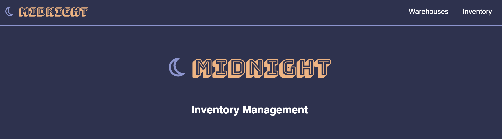
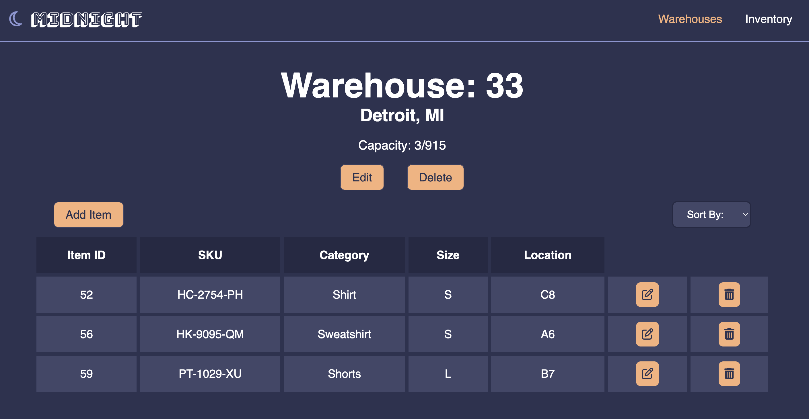

# Midnight Inventory Management

## Overview

Welcome to the Midnight Inventory Management Front-End Repository! This repository houses the front-end code for the Midnight Inventory Management application.
- Backend code: [click here](https://github.com/andrea1234321/inventory-management)

The Midnight Inventory Management app allows you to effortlessly manage inventory across multiple warehouses. Easily identify the items stored in each warehouse and make necessary edits with ease.

## Attributions:
- [Animate.css](https://animate.style/)
- [Font Awesome](https://fontawesome.com/)

## Technologies Used:
- FrontEnd:
  - JavaScript
  - React.js
  - CSS

- BackEnd: 
  - Spring Boot
  - Java
  - PostgreSQL
  - Postman
